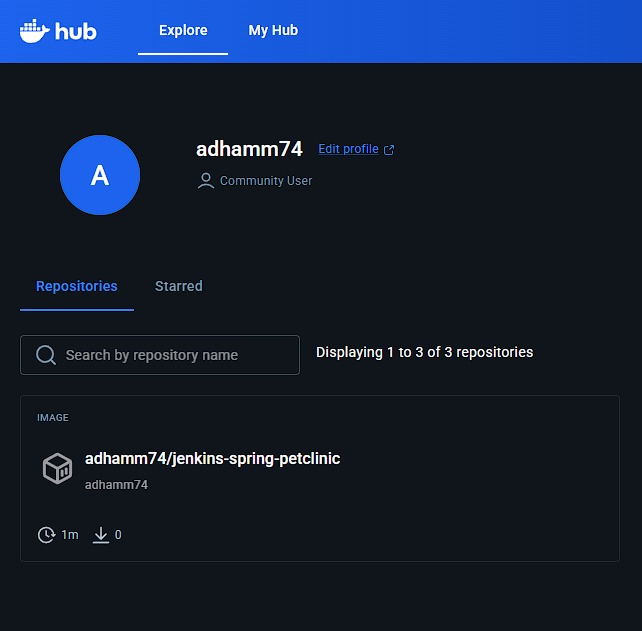
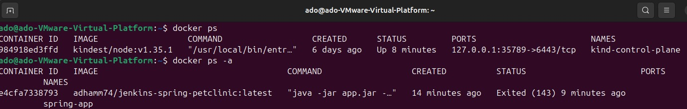
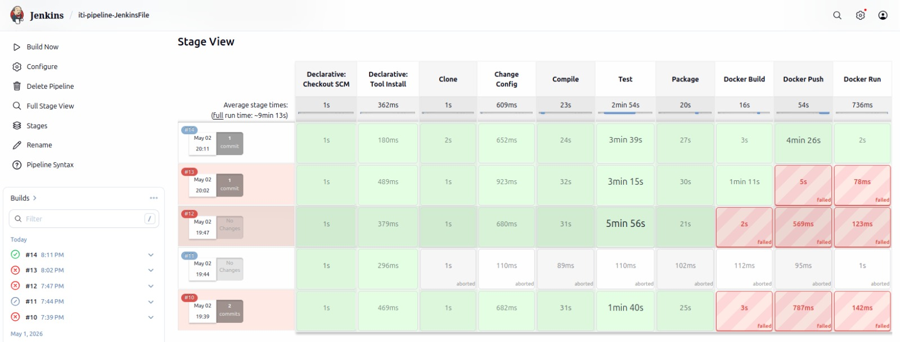

# 🚀 Jenkins CI/CD Pipeline for Spring Boot with Docker

This project demonstrates a **complete DevOps workflow** using Jenkins to automate the build, test, packaging, containerization, and deployment of a Spring Boot application.

It is designed as a **hands-on CI/CD pipeline** suitable for learning, practice, and showcasing in a DevOps portfolio.

---

# 📌 Project Overview

This pipeline automates the full lifecycle of a Java Spring Boot application:

```
Code → Build → Test → Package → Dockerize → Push → Deploy
```

---

# 🧱 Pipeline Architecture

The pipeline is implemented using a **Declarative Jenkins Pipeline** and consists of the following stages:

1. **Clone Source Code**
2. **Modify Application Configuration**
3. **Compile the Project**
4. **Run Unit Tests**
5. **Package Application (JAR)**
6. **Build Docker Image**
7. **Push Image to Docker Hub**
8. **Run Docker Container**

---

# ⚙️ Technologies Used

- Jenkins (CI/CD)
- Maven (Build Tool)
- JDK 17
- Docker
- Spring Boot
- GitHub

---

# 📂 Repository Structure

```
.
├── Jenkinsfile
├── Dockerfile
├── README.md
└── src/
```

---

# 🏗️ Pipeline Stages Explained

## 🔹 1. Clone Stage

Clones the application source code from GitHub.

```bash
git clone https://github.com/AdhamKhaled74/Jenkins-spring-petclinic.git
```

---

## 🔹 2. Change Config Stage

Modifies the application port dynamically:

```bash
echo server.port=8081 >> src/main/resources/application.properties
```

---

## 🔹 3. Compile Stage

Compiles the source code:

```bash
mvn clean compile
```

---

## 🔹 4. Test Stage

Runs unit tests:

```bash
mvn test
```

---

## 🔹 5. Package Stage

Creates the executable JAR file:

```bash
mvn package -DskipTests
```

Output:

```
target/*.jar
```

---

## 🐳 6. Docker Build Stage

Builds a Docker image from the JAR file:

```bash
docker build -t adhamm74/jenkins-spring-petclinic:latest .
```

---

## 🔐 7. Docker Push Stage

Pushes the image to Docker Hub securely using Jenkins credentials:

```bash
docker login
docker push adhamm74/jenkins-spring-petclinic:latest
```

### Credentials Required:

- ID: `dockerhub-creds`
- Type: Username/Password

### DockerHub After Pushing an image:

## 

---

## 🚀 8. Docker Run Stage

Runs the container:

```bash
docker run -d -p 9090:8081 --name spring-app adhamm74/jenkins-spring-petclinic:latest
```

## 

---

# 🌍 Application Access

After deployment, access the application at:

```
http://localhost:9090
```

---

# 🧪 Testing the Application

### Using Browser:

Open:

```
http://localhost:9090
```

### Using curl:

```bash
curl http://localhost:9090
```

---

# 📦 Dockerfile

```dockerfile
FROM eclipse-temurin:17-jdk-alpine
WORKDIR /app
COPY target/*.jar app.jar
ENTRYPOINT ["java","-jar","app.jar"]
```

---

# ⚙️ Jenkins Pipeline

## 

---

# ⚙️ Jenkins Configuration

## 1. Add Tools

Go to:

```
Manage Jenkins → Global Tool Configuration
```

Add:

- Maven → Name: `mvn`
- JDK → Name: `JDK-17`

---

## 2. Add DockerHub Credentials

Go to:

```
Manage Jenkins → Credentials → Global → Add Credentials
```

Add:

- Kind: Username/Password
- ID: `dockerhub-creds`
- Username: your DockerHub username
- Password: your DockerHub password

---

## 3. Fix Docker Permissions (IMPORTANT)

Allow Jenkins to use Docker:

```bash
sudo usermod -aG docker jenkins
sudo systemctl restart jenkins
```

---

# ⚠️ Common Issues & Solutions

### ❌ Docker Permission Denied

**Cause:** Jenkins not in docker group
**Fix:**

```bash
sudo usermod -aG docker jenkins
```

---

### ❌ Invalid Image Name

**Cause:** Uppercase letters in image name
**Fix:** Use lowercase only

---

### ❌ Docker Push Access Denied

**Cause:** Wrong credentials or repo not created
**Fix:**

- Verify DockerHub login
- Ensure repo exists

---

### ❌ App Not Accessible

**Cause:** Port mismatch
**Fix:**
Check:

```
docker run -p 9090:8081
```

---

# 🎯 Key Learning Outcomes

- Writing Jenkins Declarative Pipelines
- Integrating Maven with Jenkins
- Building Docker images from Java apps
- Using Jenkins credentials securely
- Automating deployment using Docker
- Debugging CI/CD pipelines

---

# 🚀 Future Improvements

- Add **Health Check stage** (using `/actuator/health`)
- Use **Docker Compose** instead of single container
- Add **Kubernetes deployment**
- Use **multi-stage Docker builds**
- Add **pipeline notifications (Slack/Email)**

---

# Author

**Adham Khaled**

---
